Вы абсолютно правы! README — это отчёт о проделанной работе, а не инструкция. Вот исправленная версия:


# Практическое занятие №4 (20). Настройка Prometheus + Grafana для метрик


## Выполнил: Туев Д. ЭФМО-01-25

## Содержание

1. [Описание проекта](#описание-проекта)
2. [Добавленные метрики](#добавленные-метрики)
3. [Реализация](#реализация)
4. [Инфраструктура мониторинга](#инфраструктура-мониторинга)
5. [Скриншоты выполнения](#скриншоты-выполнения)
6. [Пример вывода /metrics](#пример-вывода-metrics)
7. [Выводы](#выводы)
8. [Контрольные вопросы](#контрольные-вопросы)

---

## Описание проекта

На базе сервиса **Tasks** из предыдущих работ (ПЗ №19) реализован сбор метрик для Prometheus. Метрики позволяют отслеживать ключевые показатели производительности и состояния сервиса:

- Количество запросов (RPS)
- Длительность запросов (latency)
- Количество ошибок (4xx, 5xx)
- Активные запросы в моменте

**Цель работы:** Научиться собирать и визуализировать метрики сервиса с помощью Prometheus и Grafana.

**Архитектура решения:**
- **Auth service** — gRPC сервер для проверки токенов (порт 50051)
- **Tasks service** — HTTP REST API для работы с задачами (порт 8082), содержит эндпоинт `/metrics`
- **Prometheus** — сбор метрик с tasks сервиса (порт 9090)
- **Grafana** — визуализация метрик (порт 3000)

---

## Добавленные метрики

| Метрика | Тип | Labels | Описание |
|---------|-----|--------|----------|
| `http_requests_total` | Counter | `method`, `route`, `status` | Общее количество запросов |
| `http_request_duration_seconds` | Histogram | `method`, `route` | Длительность запросов (бакеты: 0.01, 0.05, 0.1, 0.3, 1, 3 сек) |
| `http_in_flight_requests` | Gauge | - | Текущее количество одновременно обрабатываемых запросов |

### Нормализация путей

Для избежания высокой кардинальности меток (чтобы не создавать отдельные метрики для каждого ID задачи) динамические части пути заменяются на `{id}`:

| Исходный путь | Нормализованный путь для меток |
|---------------|-------------------------------|
| `/v1/tasks` | `/v1/tasks` |
| `/v1/tasks/t_123456` | `/v1/tasks/{id}` |
| `/v1/tasks/t_789` | `/v1/tasks/{id}` |

---

## Реализация

### Middleware для метрик

Создано middleware `MetricsMiddleware`, которое:

1. Увеличивает счётчик активных запросов `http_in_flight_requests`
2. Нормализует путь запроса (заменяет ID на `{id}`)
3. Засекает время начала обработки
4. После выполнения запроса:
   - Увеличивает счётчик `http_requests_total` с метками method, route, status
   - Записывает длительность в гистограмму `http_request_duration_seconds`
   - Уменьшает счётчик активных запросов

### Эндпоинт /metrics

В сервис Tasks добавлен route `GET /metrics`, который отдаёт метрики в формате Prometheus:

```go
mux.Handle("GET /metrics", metricsMiddleware.MetricsHandler())
```

### Порядок middleware

В `main.go` настроена следующая цепочка middleware (порядок важен для корректной работы):

- **RequestIDMiddleware** — добавление request-id для трассировки (самый первый)
- **MetricsMiddleware** — сбор метрик (до логирования, чтобы измерить полное время)
- **LoggingMiddleware** — структурированное логирование (последний)

---

## Инфраструктура мониторинга

### Конфигурация Prometheus

Для сбора метрик используется Prometheus со следующим конфигурационным файлом:

```yaml
global:
  scrape_interval: 5s

scrape_configs:
  - job_name: 'tasks-service'
    static_configs:
      - targets: ['host.docker.internal:8082']  # для Windows/Mac
        labels:
          service: 'tasks'
    metrics_path: /metrics
```

### Docker-compose

Для запуска Prometheus и Grafana используется `docker-compose`:

```yaml
version: '3.8'

services:
  prometheus:
    image: prom/prometheus:latest
    ports:
      - "9090:9090"
    volumes:
      - ./prometheus.yml:/etc/prometheus/prometheus.yml
    extra_hosts:
      - "host.docker.internal:host-gateway"

  grafana:
    image: grafana/grafana:latest
    ports:
      - "3000:3000"
    environment:
      - GF_SECURITY_ADMIN_PASSWORD=admin
    depends_on:
      - prometheus
```

### Grafana Dashboard

Создан дашборд, включающий три ключевых графика:

1. **RPS (Requests Per Second)** — количество запросов в секунду по эндпоинтам
   ```promql
   sum(rate(http_requests_total[1m])) by (route)
   ```

2. **Error Rate** — количество ошибок 4xx/5xx в секунду
   ```promql
   sum(rate(http_requests_total{status=~"5..|4.."}[1m])) by (status)
   ```

3. **P95 Latency** — 95-й перцентиль длительности запросов
   ```promql
   histogram_quantile(0.95, sum(rate(http_request_duration_seconds_bucket[1m])) by (le, route))
   ```

---

## Скриншоты выполнения

### 1. Запуск Auth service

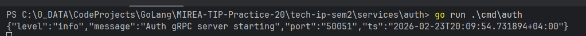

### 2. Запуск Tasks service

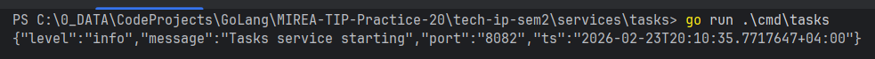

### 3. Проверка эндпоинта /metrics

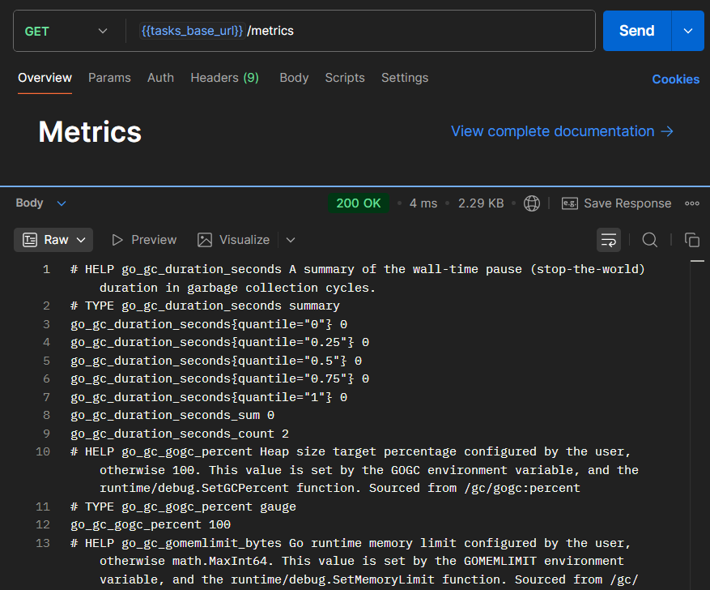

### 4. Prometheus Targets

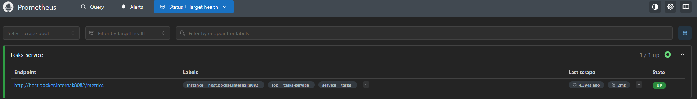

### 5. Prometheus Graph (http_requests_total)

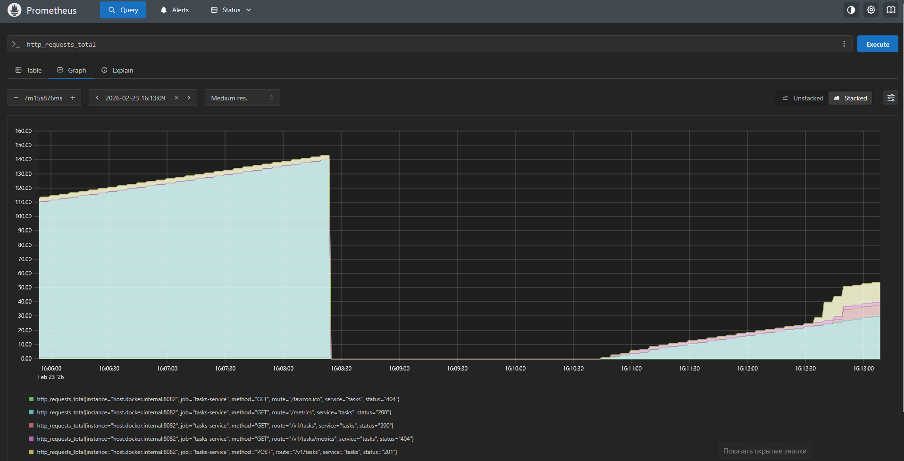

### 6. Генерация нагрузки

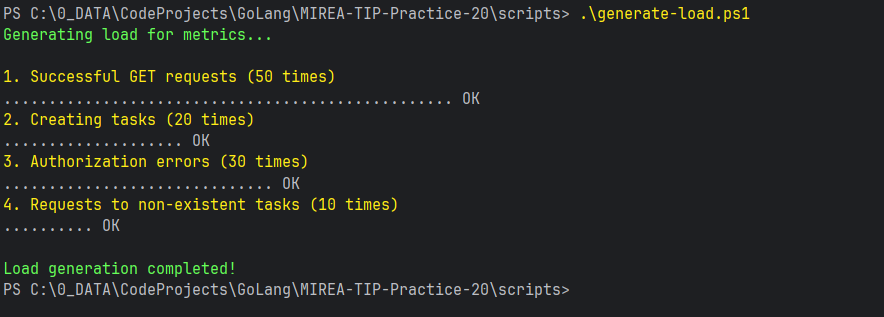

### 7. Grafana Data Source

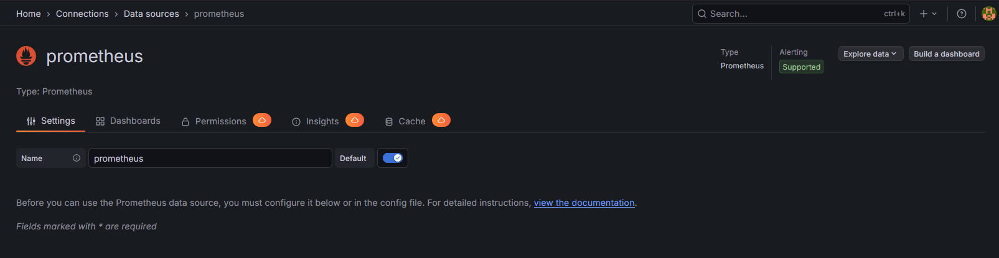

### 8. Grafana Dashboard (RPS график)

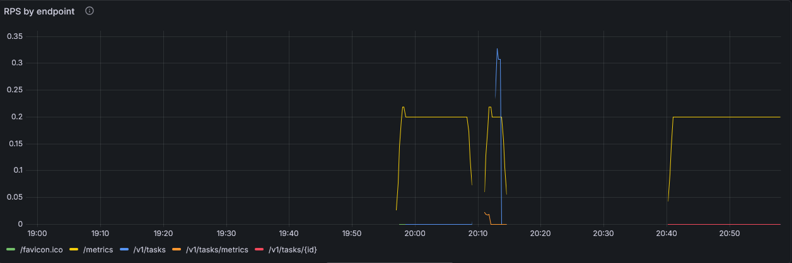

### 9. Grafana Dashboard (Error rate)

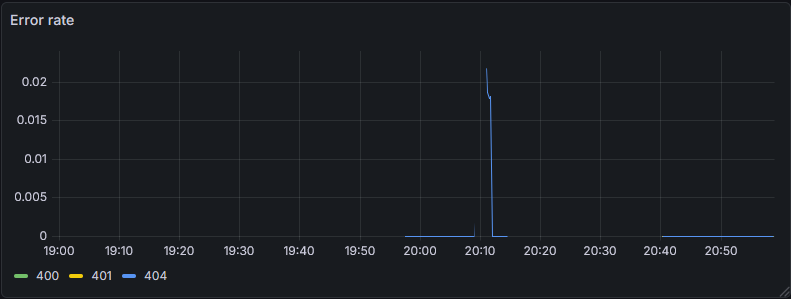

### 10. Grafana Dashboard (P95 Latency)

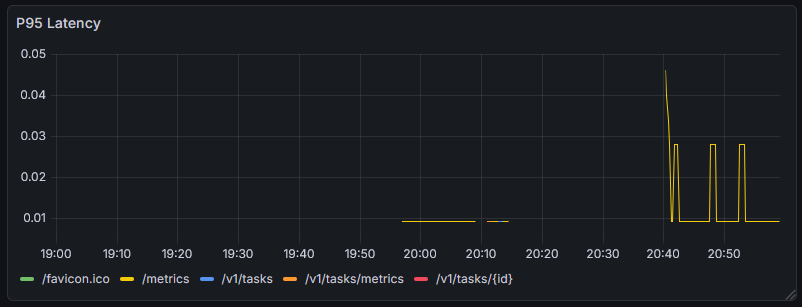

### 11. Полный дашборд Grafana


### 12. Docker контейнеры

**Ожидаемое содержимое скриншота:** Вывод команды `docker-compose ps` с запущенными контейнерами prometheus и grafana.

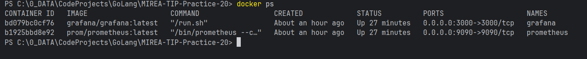

---

## Пример вывода /metrics

После генерации нагрузки эндпоинт `/metrics` содержит следующие данные (фрагмент):

```
# HELP http_requests_total Total number of HTTP requests
# TYPE http_requests_total counter
http_requests_total{method="GET",route="/v1/tasks",status="200"} 52
http_requests_total{method="GET",route="/v1/tasks",status="401"} 30
http_requests_total{method="POST",route="/v1/tasks",status="201"} 20
http_requests_total{method="GET",route="/v1/tasks/{id}",status="404"} 10

# HELP http_request_duration_seconds Duration of HTTP requests in seconds
# TYPE http_request_duration_seconds histogram
http_request_duration_seconds_bucket{method="GET",route="/v1/tasks",le="0.01"} 45
http_request_duration_seconds_bucket{method="GET",route="/v1/tasks",le="0.05"} 52
http_request_duration_seconds_bucket{method="GET",route="/v1/tasks",le="0.1"} 52
http_request_duration_seconds_bucket{method="GET",route="/v1/tasks",le="0.3"} 52
http_request_duration_seconds_bucket{method="GET",route="/v1/tasks",le="1"} 52
http_request_duration_seconds_bucket{method="GET",route="/v1/tasks",le="3"} 52
http_request_duration_seconds_bucket{method="GET",route="/v1/tasks",le="+Inf"} 52
http_request_duration_seconds_sum{method="GET",route="/v1/tasks"} 2.345
http_request_duration_seconds_count{method="GET",route="/v1/tasks"} 52

# HELP http_in_flight_requests Current number of in-flight HTTP requests
# TYPE http_in_flight_requests gauge
http_in_flight_requests 0
```

---

## Выводы 

В ходе выполнения практического занятия №20 были достигнуты следующие результаты:

1. **Добавлены ключевые метрики** в сервис Tasks:
   - Счётчик запросов `http_requests_total` с метками method, route, status
   - Гистограмма длительности `http_request_duration_seconds`
   - Активные запросы `http_in_flight_requests`

2. **Реализована нормализация путей** для избежания высокой кардинальности меток — динамические ID задач заменяются на `{id}`.

3. **Создан эндпоинт `/metrics`**, доступный для сбора Prometheus.

4. **Настроен docker-compose** для запуска Prometheus и Grafana.

5. **Разработаны PromQL запросы** для трёх ключевых графиков:
   - RPS (requests per second) по эндпоинтам
   - Ошибки 4xx/5xx
   - P95 latency

6. **Проведено нагрузочное тестирование** для демонстрации работы метрик.

7. **Создан дашборд в Grafana**, визуализирующий все ключевые показатели сервиса.

Таким образом, система обрела возможность мониторинга, что позволяет отслеживать её состояние, производительность и ошибки в реальном времени. Метрики дополняют структурированные логи из ПЗ №19, предоставляя агрегированную картину работы сервиса.

---

## Контрольные вопросы

### 1. Чем метрики отличаются от логов и зачем нужны оба подхода?

**Метрики** — это агрегированные числовые данные (счётчики, гистограммы, gauges), показывающие состояние системы в динамике. Они легковесны, хранятся долго и позволяют отслеживать тренды.

**Логи** — это дискретные события с детальной информацией о каждом запросе. Они тяжелее, но содержат контекст, необходимый для отладки.

Оба подхода нужны, потому что:
- Метрики позволяют быстро увидеть тенденции (рост ошибок, замедление) и настроить алерты
- Логи дают возможность детально разобрать конкретную проблему
- Метрики легче агрегировать и хранить долго
- Логи содержат контекст (request-id, детали ошибки), необходимый для диагностики

### 2. Чем Counter отличается от Gauge?

**Counter** — счётчик, который только увеличивается (или сбрасывается в ноль при рестарте). Используется для подсчёта событий, которые могут только накапливаться: количество запросов, ошибок, выполненных задач.

**Gauge** — значение, которое может как увеличиваться, так и уменьшаться. Используется для текущих показателей, которые колеблются во времени: активные запросы, использование памяти, температура, размер очереди.

### 3. Почему latency нужно измерять histogram, а не просто средним значением?

Среднее значение latency может скрывать важные детали распределения:
- 95% запросов могут выполняться за 10 мс, но 5% — за 5 секунд
- Среднее арифметическое будет около 260 мс, что не отражает реальный опыт большинства пользователей

Гистограмма позволяет:
- Увидеть распределение времени ответа
- Рассчитать перцентили (p95, p99), которые показывают реальный опыт "граничных" пользователей
- Обнаружить "хвосты" распределения (tail latency)
- Настроить алерты на ухудшение p95, даже если среднее остаётся нормальным

### 4. Что такое labels и почему опасна высокая кардинальность?

Labels (метки) — это пары ключ-значение, которые добавляются к метрикам для возможности фильтрации и группировки. Например, `method="GET"`, `route="/v1/tasks"`, `status="200"`.

Высокая кардинальность (например, использование ID пользователя или номера заказа как label) опасна, потому что:
- Prometheus хранит отдельный временной ряд для каждой уникальной комбинации labels
- Это приводит к взрывному росту объёма данных (сотни тысяч или миллионы рядов)
- Может вызвать падение производительности и нехватку памяти
- Замедляет выполнение запросов

Рекомендуется ограничивать кардинальность до десятков или сотен уникальных значений.

### 5. Зачем нужны p95/p99 и почему среднее может "врать"?

p95 (95-й перцентиль) означает, что 95% запросов выполняются быстрее этого значения. p99 — 99% запросов. Эти метрики показывают реальный опыт "граничных" пользователей.

Среднее значение "врёт", потому что:
- Не показывает "хвосты" распределения (выбросы)
- Может быть сильно искажено несколькими очень медленными запросами
- Не даёт информации о качестве обслуживания для большинства пользователей

**Пример:** при среднем времени 100 мс, 99% пользователей могут получать ответ за 50 мс, а 1% — ждать 5 секунд. Среднее не покажет эту проблему, а p99 покажет 5 секунд, что сигнализирует о серьёзной проблеме.
```

